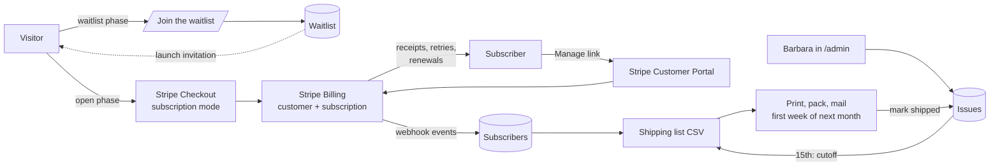

# The Budderlee Post: Framework Plan

Planning document, updated 12 September 2026 with Barbara's decisions
(recorded in `SUBSCRIPTION-QUESTIONS.md`). Nothing in this document is
built yet. It describes what the subscription is, how it fits the site as
it exists today, and the order to build it in.

---

## 1. The product

**The Budderlee Post.** A monthly story-and-art subscription by mail.
$12 a month, U.S. shipping included. One Budderlee resident per month.

Each standard package contains:

| Item | Detail |
| --- | --- |
| **Resident character and art card** | 5×7 card stock. The painting on the front; the character profile on the back: name, resident number, date of birth, star sign, job in the village, and friends. |
| **Tales from Budderlee** | A serialized story about that month's resident. Each chapter continues from the last, so the packages read as one ongoing tale. |
| **Recipe card** | A tested, character-driven original recipe. |
| **Surprise gift sticker** | A professionally printed die-cut sticker, ordered in bulk. |
| **Personal note** | A short welcome for a subscriber's first package, a thank-you for every one after. |

Founding members (waitlist members who subscribe at launch) also receive
an exclusive Founding Member sticker in their first package. That sticker
is a separate, one-time design.

First resident: **Walter, Resident 001, the Tailor**. First cutoff
October 15, 2026; first package mails the first week of November 2026.

Working assumptions: Barbara packs and ships from the studio; cards,
recipe cards, and stickers are printed in bulk by outside vendors. If a
print partner ever ships direct, only the fulfillment step changes.

## 2. Decisions

| Question | Decision |
| --- | --- |
| Name | The Budderlee Post. Card statement reads `BUDDERLEE POST`. |
| Price | $12 a month, U.S. shipping included. Monthly only at launch; annual and gift options later. |
| Self-service | Stripe Customer Portal. No accounts on the site. A "Manage my subscription" page emails the subscriber a secure portal link. |
| Launch | Waitlist first, then open to the waitlist with the Founding Member sticker. |
| Cap | 100 subscribers. At the cap, the page returns visitors to the waitlist. |
| Cutoff and mailing | Signups through the 15th get the next mailing. Packages mail the first week of the following month. |
| Shipping | United States only. Canada evaluated after the routine settles. |
| Email lists | The waitlist and the collector newsletter stay completely separate. |
| Sales tax | Accountant guidance required before paid signups open. Stripe Tax is ready to switch on if the advice is to collect. |
| Billing provider | Stripe Billing, on the Stripe account the site already uses. |

## 3. How it fits together

Everything reuses what the site already has: Stripe Checkout and the
Stripe webhook, Payload CMS on Postgres, Resend for email, and the cron
pattern used for social posts.

**Stripe does the money.** A recurring $12 Price on a "The Budderlee
Post" Product with the statement descriptor `BUDDERLEE POST`. Checkout
runs in subscription mode and collects the shipping address, U.S. only.
Stripe sends receipts, retries failed cards, warns about expiring cards,
and handles cancellations through the portal. The site never stores card
data.

**Payload holds the people and the content.** Who is on the waitlist, who
is subscribed, what each month's package contains, and what has shipped.
Barbara works entirely in the admin she already uses.

**The webhook keeps them in sync.** Every subscription change in Stripe
lands in the Subscribers collection within seconds. The shipping list is
always built from that table, never by hand.

**Resend sends the human emails.** Waitlist confirmation, the launch
invitation, welcome, optional "on its way", and studio notifications.
Stripe's own emails cover the billing side.

### Billing timing

Two cases, both handled by Stripe Checkout settings, no custom billing
code:

- **Signup on or before the 15th.** Charged $12 immediately. First
  package is the next mailing (first week of the following month).
  Renews on the same day each month.
- **Signup after the 15th.** Not charged at signup. Checkout starts the
  subscription with a free period that ends on the next 15th, when the
  first $12 is charged. First package is the mailing after that cutoff.
  Renews on the 15th thereafter. The page and the welcome email say
  exactly which date the card is charged and which week the package
  mails, so nobody pays six weeks before receiving anything.

Either way, each charge pays for the next mailing after the next cutoff,
and the shipping list at each cutoff is simply "every subscriber whose
status is active".

## 4. Data model

### Existing collection: Paintings (Budderlee residents)

Add these under the existing Budderlee fields, shown only when the
painting's collection is Budderlee:

| Field | Type | Notes |
| --- | --- | --- |
| `residentNumber` | number | Walter is 001. Printed on the card and used for "collect them all" ordering. |
| `dateOfBirth` | date | Month and day matter; year optional. |
| `starSign` | select | Twelve options, auto-filled from the date of birth. |
| `characterRole` | text | Already exists. This is the job ("Tailor"). |
| `friends` | relationship, many | Other Budderlee paintings. Renders as names on the card. |

### New global: The Budderlee Post settings

One record Barbara edits without a deploy.

| Field | Purpose | Launch value |
| --- | --- | --- |
| `phase` | `waitlist`, `open`, or `closed`. Drives the landing page. | `waitlist` |
| `stripePriceId` | The monthly Price. | set after Stripe setup |
| `subscriberCap` | Maximum active subscribers. At the cap, back to the waitlist. | 100 |
| `cutoffDay` | Signups through this day get the next mailing. | 15 |
| `foundingWindowEnds` | Waitlist members who subscribe before this date are founding members. | October 15, 2026 |
| `nextMailing` | Month shown on the page and in emails. | November 2026 |

### New collection: Waitlist

Stored in the admin only, **not** as Resend contacts. The existing
Newsletters tool sweeps every Resend contact into the collector segment
before each send, so the only way to keep the two lists fully separate is
to keep the waitlist out of Resend. The launch invitation is sent from
the Waitlist admin instead (section 5).

| Field | Notes |
| --- | --- |
| `email`, `name` | Name optional. |
| `joinedAt`, `invitedAt`, `subscribedAt` | The funnel: joined, invited, converted. |
| `source` | Budderlee page, Instagram link, a show. |

### New collection: Subscribers

Written only by the Stripe webhook. Read-only in the admin except for
notes.

| Field | Notes |
| --- | --- |
| `email`, `name` | From Stripe's customer record. |
| `stripeCustomerId`, `stripeSubscriptionId` | Unique. |
| `status` | `active`, `trialing` (signed up after the cutoff, not yet charged), `past_due`, `paused`, `canceled`. Mirrors Stripe. |
| `currentPeriodEnd` | Next renewal date. |
| `shippingAddress` | Synced from Stripe on every update, so portal address changes flow through. |
| `foundingMember` | True when the checkout email matches a Waitlist row and the subscription started before `foundingWindowEnds`. |
| `packagesSent` | Count, incremented when a shipment is marked shipped. Zero means the next package is their first. |
| `startedAt`, `canceledAt`, `cancelReason` | The portal collects a cancellation reason. |
| `notes` | Barbara's own, e.g. "allergic to nuts". |

### New collection: Issues

The monthly unit of work. One per **mailing month**. The November 2026
issue is Walter; its cutoff is October 15.

| Field | Notes |
| --- | --- |
| `mailingMonth` | e.g. 2026-11. Unique. |
| `resident` | Relationship to the Budderlee painting. |
| `storyTitle`, `story` | The Tales from Budderlee chapter, rich text. |
| `recipeTitle`, `recipe` | Ingredients and method, rich text. |
| `stickerNote` | What this month's sticker is. |
| `status` | `planning`, `at printer`, `ready to ship`, `shipped`. |
| `shippingListGeneratedAt` | When the shipment rows were snapshotted. |

Because the card back, recipe card, and story all live here, the site can
render **print-ready views** at their real dimensions. Barbara writes once
and downloads a PDF for the printer. Optional in the first release, and
the single biggest time-saver in the monthly cycle.

### New collection: Shipments

One row per subscriber per issue, created at the cutoff.

| Field | Notes |
| --- | --- |
| `issue`, `subscriber` | Relationships. |
| `addressSnapshot` | The address at the cutoff, so a later portal change applies to next month, not a batch already labeled. |
| `firstPackage` | True when `packagesSent` was zero at the cutoff. Tells Barbara which note to write. |
| `includeFoundingSticker` | True for a founding member's first package. |
| `status` | `pending`, `shipped`, `skipped`. |
| `trackingNumber`, `shippedAt` | Optional. |

## 5. Pages, routes, and admin actions

### Public pages

| Path | Purpose |
| --- | --- |
| `/budderlee/post` | The landing page for The Budderlee Post. What's in the package, a sample card front and back, $12 a month, the next mailing month, FAQ. Waitlist phase: "Join the waitlist". Open phase: "Subscribe" to Stripe Checkout, with the exact charge date and first-mailing week shown before the button. At the cap: back to the waitlist. |
| `/budderlee/post/welcome` | After checkout. Confirms the first mailing and links to the manage page. |
| `/budderlee/post/manage` | Email field. Sends a Stripe portal link if the address belongs to a subscriber. Always replies "if that address has a subscription, a link is on its way". |

The existing `/budderlee` page gets a section pointing at the landing
page, and the homepage gets a mention once signups open.

### API routes

| Route | Does |
| --- | --- |
| `POST /api/post/waitlist` | Validates the email, creates the Waitlist row, sends the confirmation, pings Barbara. |
| `POST /api/post/checkout` | Checks phase and cap, works out whether the signup is before or after the cutoff, creates a subscription-mode Checkout Session with shipping address collection (and a free period to the next 15th when after the cutoff). |
| `POST /api/post/portal` | Looks up the subscriber, creates a portal session, emails the link. |
| `POST /api/stripe-webhook` | Existing route. Adds subscription created, updated, and deleted; invoice paid and payment failed; customer address updates. Sets `foundingMember` on creation. |

### Admin actions

On the **Waitlist** list: **Send launch invitation**. Emails every
un-invited waitlist member through Resend with the landing page link and
the Founding Member offer, and stamps `invitedAt`. This replaces the
Newsletters tool for this list so the two audiences never mix.

On an **Issue**:

- **Generate shipping list** at the cutoff. Snapshots every `active`
  subscriber (and `past_due` inside Stripe's retry window, Barbara's
  call) into Shipments rows with the first-package and founding-sticker
  flags set.
- **Download CSV**: name, address lines, email, first package yes/no,
  founding sticker yes/no. Column layout matches what Pirate Ship and
  USPS Click-N-Ship import.
- **Mark shipped**, all at once or row by row. Increments each
  subscriber's `packagesSent`.

## 6. The monthly cycle

| When | What |
| --- | --- |
| 1st to 15th | Signups accumulate for the next mailing. Barbara writes the Tales chapter and tests the recipe for that issue. Fills in the resident's profile if it isn't there yet. |
| 15th, cutoff | Generate the shipping list. Read the count. Order cards, recipe cards, and stickers for that count plus a small buffer. |
| Last week of the month | Prints and stickers arrive. Write the welcome notes for first-package rows and thank-you notes for the rest. |
| First week of next month | Pack and mail. Mark shipped. Optionally send the "on its way" email. |
| Ongoing | Stripe emails Barbara on failed payments and cancellations; the site emails her on every new subscriber and waitlist signup. |

Start with buttons Barbara presses. The cutoff can become a scheduled job
later using the existing cron pattern.

## 7. Economics at $12

Per-package cost estimates at 100 units, for Barbara to check against her
actual vendors. Not quotes.

| Cost | Estimate |
| --- | --- |
| 5×7 double-sided card, heavy stock | $0.40 to $1.00 |
| 4×6 double-sided recipe card | $0.25 to $0.60 |
| Die-cut vinyl sticker, bulk | $0.30 to $0.80 |
| Tales sheet, folded | $0.15 to $0.50 |
| Note card | $0.10 to $0.30 |
| Rigid mailer with backing board | $0.50 to $1.00 |
| USPS postage, 6×9 rigid envelope | $1.50 to $2.50 |
| Stripe fee on $12 (2.9% + $0.30) | $0.65 |
| **Total per package** | **about $3.85 to $7.35** |

| At 100 subscribers | Per month |
| --- | --- |
| Gross | $1,200 |
| After Stripe fees | $1,135 |
| After package costs | about $465 to $815 |

That is before Barbara's time and before the Founding Member sticker
run. The price is low for what's in the envelope, which is a fine choice
for a launch and easy to raise for new subscribers later (Stripe lets
existing subscribers keep their price). Postage is the biggest single
line; a lighter mailer or a folded-card format would move it most.

Stripe Tax is one switch away if the accountant says to collect.

## 8. Emails

| Email | Sender | Trigger |
| --- | --- | --- |
| Waitlist confirmation | Resend | Joining the waitlist |
| Launch invitation | Resend, from the Waitlist admin action | Barbara presses Send launch invitation |
| Welcome | Resend | Subscription created. States the charge date, the first mailing week, and the manage link. |
| Receipt, renewal, failed payment, expiring card | Stripe | Automatic once enabled in the Stripe dashboard |
| Manage link | Resend | Requested on the manage page |
| Package on its way (optional) | Resend | Barbara marks an issue shipped |
| New subscriber, waitlist signup, cancellation, payment failure | Resend, to Barbara | Webhook and form events |

## 9. Build order and timeline

The first cutoff is October 15, 2026, five weeks from today. That is
tight but workable if the waitlist ships this month and paid signups open
by early October. The gate on paid signups is the accountant's sales-tax
guidance, not the code.

| # | Phase | Size | Target |
| --- | --- | --- | --- |
| 1 | **Stripe setup** (no code). Product and $12 Price with the `BUDDERLEE POST` descriptor. Customer Portal: card and address updates, pause, cancel with reason. Subscription events on the webhook. Stripe Tax ready to enable. | none | this week |
| 2 | **Waitlist.** Settings global, Waitlist collection and migration, landing page in waitlist mode, waitlist route, confirmation email, link from the Budderlee page. | small | shipped September 12 |
| 3 | **Content model.** Resident profile group on Paintings (number, birthday, star sign, friends), Issues collection, migration. Barbara enters Walter and writes the November issue. | small | shipped September 12 |
| 4 | **Checkout.** Checkout route with the cutoff logic, webhook handlers, Subscribers collection, welcome and manage pages, signed portal links, notifications. Stripe setup steps are in DEPLOY.md. | medium | in review |
| 5 | **Fulfillment.** Shipments collection, generate list, CSV export, mark shipped, cap enforcement. | medium | ready by October 15 |
| 6 | **Launch.** Accountant sign-off. Flip the phase to open. Send the launch invitation. Announce on social with the existing tools. | none | early October |
| 7 | **Later.** Print-ready PDFs. Annual and gift subscriptions. Canada. A public archive of past residents. Back issues for sale. Skip a month from the portal. | | when ready |

If the accountant's guidance slips past early October, the waitlist keeps
collecting and the first mailing moves to December. Nothing else has to
change.

## 10. Still open

- **Accountant sign-off on sales tax.** Required before paid signups
  open. Barbara's questions to the accountant are prepared.
- **Card and sticker vendors and their turnaround.** Decides whether a
  15th cutoff can reliably mail in the first week of the next month.
- **The Founding Member sticker design.** A one-time run; needs to be
  ordered before the November mailing.

## 11. Risks and notes

- **Timeline.** Five weeks to the first cutoff. The waitlist is the
  priority; everything else has a fallback of a one-month slip.
- **Vendor lead time.** The runbook leaves two to three weeks between
  cutoff and mailing. Confirm both vendors can do it.
- **Margin at $12.** Healthy at studio scale, sensitive to postage. Worth
  weighing the mailer with a real package before ordering 100.
- **Address changes mid-batch.** The Shipments snapshot handles it.
- **Past-due subscribers.** Stripe retries failed cards over about a
  week. Recommend they still get the package during the retry window.
- **The cap is enforced by the site, not Stripe.** Two people subscribing
  in the same second could push the count to 101. Acceptable.
- **Migrations run on deploy.** Every new collection needs a committed
  migration, per the existing deploy process.
- **Test mode first.** Stripe test mode covers subscriptions, the portal,
  the free-period-to-cutoff case, renewals, and failed payments.

## 12. Environment and configuration

No new secrets are required. The existing Stripe, Resend, Postgres, and
cron secrets cover everything. The Price ID and the other knobs live in
the settings global. The Stripe webhook endpoint needs the subscription
event types enabled in the dashboard.
