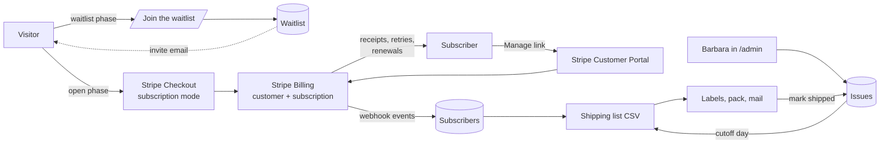

# Budderlee Monthly Subscription — Framework Plan

Planning draft, 12 September 2026. Nothing in this document is built yet.
It describes what the subscription is, how it fits the site as it exists
today, what Barbara has to decide, and the order to build it in.

---

## 1. The product

One Budderlee resident per month, mailed to the subscriber. Each package
contains:

| Item | Detail |
| --- | --- |
| **5×7 resident card** | Card-stock reproduction of the original painting. The back carries the character profile: name, date of birth, star sign, job in the village, and friends. |
| **The village newsletter** | A serialized story about that month's resident. Each chapter continues from the previous month, so the packages read as one ongoing tale. |
| **3-inch Budderlee sticker** | Die-cut vinyl. |
| **Recipe card (bonus)** | An original recipe tied to the character (Maisie the Pie Maker gets a pie, and so on). |

Working assumptions, to be confirmed with Barbara:

- Barbara packs and ships from the studio. Cards, recipe cards, and stickers
  are printed in bulk by an online or local printer. If a print partner
  ever ships direct, only the fulfillment section changes; the site,
  billing, and content model stay the same.
- Shipping is US-only at launch, matching the existing gallery checkout.
- Shipping is included in the monthly price. One number is easier to
  explain and easier to compare.

## 2. Decisions already made

| Question | Decision |
| --- | --- |
| Self-service (card, address, pause, cancel) | **Stripe Customer Portal.** No accounts on the site. A "Manage my subscription" page emails the subscriber a secure portal link. |
| Launch | **Waitlist first.** Collect interest now, then open signups to the list with a founding-member offer. |
| Billing provider | **Stripe Billing**, on the Stripe account the site already uses for paintings, prints, and commission deposits. |
| Price, tiers, prepaid | Not decided. See section 7. The design below assumes one monthly tier and leaves room for a prepaid option and more tiers later. |

## 3. How it fits together

Everything reuses what the site already has: Stripe Checkout and the
Stripe webhook, Payload CMS on Postgres, Resend for email, and the cron
pattern used for social posts.

**Stripe does the money.** A recurring Price on a "Budderlee monthly"
Product. Checkout runs in subscription mode and collects the shipping
address. Stripe sends receipts, retries failed cards, emails the
subscriber when a card is about to expire, and handles cancellations
through the portal. The site never stores card data.

**Payload holds the people and the content.** Who is subscribed, what
each month's package contains, and what has shipped. Barbara works
entirely in the admin she already uses.

**The webhook keeps them in sync.** Every subscription change in Stripe
(new, renewed, past due, paused, canceled, address updated) lands in the
Subscribers collection within seconds. The shipping list is always built
from that table, never by hand.

**Resend sends the human emails.** Waitlist confirmation, welcome,
optional "your package is on its way", and studio notifications to
Barbara. Stripe's own emails cover the transactional billing side.

### Billing timing (recommendation)

Charge the full month at signup and renew on the same day each month.
A monthly **cutoff day** (say the 20th) decides which package a new
subscriber receives first: sign up on or before the cutoff and this
month's resident ships; sign up after and next month's does. This keeps
one fulfillment batch per month without prorating anyone.

The alternative, anchoring every renewal to the 1st, gives tidier
accounting but means a mid-month signup either pays a prorated partial
month (confusing on the receipt) or waits weeks for the first charge.
Recommend the simple version. Stripe supports either without code
changes later.

## 4. Data model

### Existing collection: Paintings (Budderlee residents)

The character profile on the card back needs a home. Add these under the
existing "Residents of Budderlee" fields, shown only when the painting's
collection is Budderlee:

| Field | Type | Notes |
| --- | --- | --- |
| `dateOfBirth` | date | Month and day matter; the year is optional flavor. |
| `starSign` | select | Twelve options. Can be auto-filled from the date of birth. |
| `characterRole` | text | Already exists ("The Pie Maker"). This is the job. |
| `friends` | relationship, many | Other Budderlee paintings. Renders as names on the card. |

### New global: Subscription settings

One record Barbara can edit without a deploy.

| Field | Purpose |
| --- | --- |
| `phase` | `waitlist`, `open`, or `closed`. Drives what the landing page shows. |
| `stripePriceId` | The monthly Price. A second field for a prepaid Price if that is offered. |
| `subscriberCap` | Maximum active subscribers. Blank means no cap. When reached, the page falls back to the waitlist. |
| `cutoffDay` | Day of the month after which new signups roll to next month's package. |
| `foundingPromoCode` | Optional Stripe promotion code applied for waitlist invitees. |
| `nextShipDate` | Shown on the landing page and in the welcome email. |

### New collection: Waitlist

| Field | Notes |
| --- | --- |
| `email`, `name` | Name optional. |
| `joinedAt`, `invitedAt`, `subscribedAt` | Tracks the funnel: joined, invited, converted. |
| `source` | Where the signup came from (Budderlee page, Instagram link, show). |

Signups also go to Resend as contacts so Barbara can email the list with
the existing Newsletters tool. Whether they land in the general studio
segment or a Budderlee-only segment is an open question (section 10).

### New collection: Subscribers

Written only by the Stripe webhook. Read-only in the admin except for a
notes field.

| Field | Notes |
| --- | --- |
| `email`, `name` | From Stripe's customer record. |
| `stripeCustomerId`, `stripeSubscriptionId` | Unique. |
| `status` | `active`, `past_due`, `paused`, `canceled`. Mirrors Stripe. |
| `currentPeriodEnd` | Next renewal date. |
| `shippingAddress` | Synced from Stripe on every update, so portal address changes flow through automatically. |
| `startedAt`, `canceledAt`, `cancelReason` | Stripe's portal collects a cancellation reason. |
| `notes` | Barbara's own, e.g. "allergic to nuts, skip the recipe card". |

### New collection: Issues

The monthly unit of work. One issue per month.

| Field | Notes |
| --- | --- |
| `month` | e.g. 2026-11. Unique. |
| `resident` | Relationship to the Budderlee painting. |
| `storyTitle`, `story` | The newsletter chapter, rich text. |
| `recipeTitle`, `recipe` | The recipe card, rich text (ingredients and method). |
| `stickerNote` | What the sticker is, for Barbara's own tracking. |
| `status` | `planning`, `at printer`, `ready to ship`, `shipped`. |
| `shippingListGeneratedAt` | When the shipment rows were snapshotted. |

Because the card back, recipe card, and newsletter all live here, the site
can render **print-ready views** of each at their real dimensions (5×7,
4×6, letter fold). Barbara writes once in the admin and downloads a PDF
for the printer. This is optional in the first release but is the single
biggest time-saver in the monthly cycle.

### New collection: Shipments

One row per subscriber per issue, created when Barbara generates the
shipping list.

| Field | Notes |
| --- | --- |
| `issue`, `subscriber` | Relationships. |
| `addressSnapshot` | The address at the moment the list was generated, so a later portal change does not silently alter a batch already labeled. |
| `status` | `pending`, `shipped`, `skipped`. |
| `trackingNumber`, `shippedAt` | Optional. Pasted back from the label tool. |

## 5. Pages, routes, and admin actions

### Public pages

| Path | Purpose |
| --- | --- |
| `/budderlee/subscribe` | The landing page. What's in the package, a sample card front and back, price, ship date, FAQ. In the waitlist phase the call to action is "Join the waitlist"; in the open phase it is "Subscribe" and goes to Stripe Checkout; when the cap is reached it returns to the waitlist. |
| `/budderlee/subscribe/welcome` | After a successful checkout. Confirms the first ship date and links to the manage page. |
| `/budderlee/subscribe/manage` | Email field. Sends a Stripe portal link to that address if it belongs to a subscriber. Always responds "if that address has a subscription, a link is on its way" so addresses cannot be probed. |

The existing `/budderlee` page gets a section pointing at the landing
page, and the homepage gets a mention once the subscription is open.

### API routes

| Route | Does |
| --- | --- |
| `POST /api/subscription/waitlist` | Validates the email, creates the Waitlist row, adds the Resend contact, sends the confirmation, pings Barbara. |
| `POST /api/subscription/checkout` | Checks the phase and cap, then creates a subscription-mode Checkout Session with shipping address collection and returns the URL. |
| `POST /api/subscription/portal` | Looks up the subscriber by email, creates a portal session, emails the link. |
| `POST /api/stripe-webhook` | Existing route. Adds handlers for `checkout.session.completed` (subscription mode), `customer.subscription.created/updated/deleted`, `invoice.paid`, `invoice.payment_failed`, and `customer.updated` (address). |

### Admin actions on an Issue

- **Generate shipping list**: snapshots every subscriber whose status is
  `active` (and, by Barbara's choice, `past_due` within Stripe's retry
  window) into Shipments rows.
- **Download CSV**: name, address lines, email, and a package count, in
  the column layout Pirate Ship and USPS Click-N-Ship import directly.
- **Mark all shipped** or tick rows individually.

## 6. The monthly cycle (Barbara's runbook)

| When | What |
| --- | --- |
| 1st | Choose the resident. Create the Issue. Write the story chapter and the recipe. Fill in the character profile on the painting if it is not already there. |
| By the 10th | Download the print-ready card back, recipe card, and newsletter. Order cards and stickers from the printer with enough lead time. |
| Cutoff day (e.g. 20th) | Generate the shipping list. Download the CSV, buy labels, pack, and mail. |
| After mailing | Mark shipped. Optionally send the "on its way" email to that month's recipients. |
| Ongoing | Stripe emails Barbara on failed payments and cancellations; the site emails her on every new subscriber. |

The cutoff can be enforced automatically with a scheduled job (the
existing GitHub Actions cron pattern) or left as a button Barbara presses.
Recommend the button first. Automation can come once the rhythm is
proven.

## 7. Pricing and economics (not decided)

Rough per-package costs at small-batch quantities (100 to 250 units).
These are estimates for Barbara to check against her actual printer and
postage; they are not quotes.

| Cost | Estimate |
| --- | --- |
| 5×7 double-sided card, heavy stock | $0.40 to $1.00 |
| 4×6 double-sided recipe card | $0.25 to $0.60 |
| 3-inch die-cut vinyl sticker | $0.30 to $0.80 |
| Newsletter, folded sheet | $0.15 to $0.50 |
| Rigid mailer or envelope with backing board | $0.50 to $1.00 |
| USPS postage, 6×9 rigid envelope | $1.50 to $2.50 |
| Stripe fee per charge | 2.9% + $0.30 |
| **Total per package before labor** | **about $3.50 to $6.50 plus the Stripe fee** |

Reference points: sticker and postcard clubs typically charge $10 to $15
a month; illustrated art-print subscriptions run $20 to $40. With four
items, an original story, and an original recipe, this package sits
closer to the print-club end. A monthly price somewhere in the **$18 to
$28** range leaves a healthy margin and covers Barbara's time. The
founding-member offer for the waitlist could be a permanent 10 to 15
percent discount or a free sticker sheet in the first package.

Stripe Tax can be switched on for the subscription so sales tax on
shipped goods is calculated per state. Whether Barbara needs to collect
it depends on where she has nexus, which is a question for her
accountant before launch.

## 8. Emails

| Email | Sender | Trigger |
| --- | --- | --- |
| Waitlist confirmation | Resend | Joining the waitlist |
| Waitlist invitation | Resend, via the Newsletters tool | Barbara sends it when signups open |
| Welcome | Resend | Subscription created. Includes first ship date and the manage link. |
| Receipt, renewal, failed payment, expiring card | Stripe | Automatic; enable under Settings → Emails in the Stripe dashboard |
| Manage link | Resend | Subscriber requests it on the manage page |
| Package on its way (optional) | Resend | Barbara marks an issue shipped |
| New subscriber, cancellation, payment failure | Resend, to Barbara | Webhook events |

## 9. Build order

Each phase is shippable on its own.

1. **Decide and set up Stripe** (no code). Name, price, cutoff day, cap,
   prepaid yes or no. Create the Product and Price, configure the
   Customer Portal (allow address and card updates, pause, cancel with
   reason), add the subscription events to the webhook, decide on Stripe
   Tax.
2. **Waitlist** (small). Subscription settings global, Waitlist
   collection and migration, the landing page in waitlist mode, the API
   route, the two emails, a link from the Budderlee page. This can go
   live within days and starts building the list while the rest is built.
3. **Content model** (small). Character profile fields on Paintings, the
   Issues collection, migration. Barbara can start writing the first
   three months of stories and recipes.
4. **Subscription checkout** (medium). Checkout route, webhook handlers,
   Subscribers collection, welcome and manage pages, portal route,
   studio notifications. Test end to end in Stripe test mode.
5. **Fulfillment** (medium). Shipments collection, generate list and CSV
   export, mark shipped, cap enforcement on checkout.
6. **Launch**. Flip the phase to open, email the waitlist with the
   founding offer through the Newsletters tool, announce on social with
   the existing tools.
7. **Later**. Print-ready PDF views of card back, recipe card, and
   newsletter. Gift subscriptions (a separate recipient address and a
   prepaid Price). International shipping. A public archive of past
   residents and a "back issues" one-off product. Pause and skip a month
   from the portal.

## 10. Open questions for Barbara

- **Name.** What is the subscription called? It appears on the card
  receipt, in emails, and on the page.
- **Price** and whether to offer a discounted 6 or 12 month prepaid
  option, which also makes gifting easy.
- **Founding-member perk** for the waitlist: a permanent discount, a
  bonus item, or both.
- **Cap.** How many packages a month can she comfortably produce? Start
  with that number and raise it.
- **Cutoff day.** The 15th or 20th are the usual choices.
- **Shipping region.** US only at launch, or Canada too?
- **First resident and first ship month.** Needed for the landing page
  and the welcome email.
- **Waitlist and the studio list.** Should waitlist signups also join the
  general collector list, or stay in their own segment?
- **Sticker production.** Printed with the cards, or from a sticker
  vendor?
- **Sales tax.** Has her accountant weighed in on collecting tax on
  shipped goods?

## 11. Risks and notes

- **Printing lead time** is the pacing item. The runbook leaves ten days
  between content and cutoff for that reason.
- **Address changes mid-batch.** The Shipments snapshot solves this: once
  a list is generated, later portal changes apply to the next month.
- **Past-due subscribers.** Stripe retries failed cards over about a
  week. Barbara decides whether past-due subscribers get that month's
  package. Recommend yes during the retry window, then not.
- **The cap is enforced by the site, not Stripe.** The checkout route
  counts active subscribers before creating a session. Two people
  subscribing in the same second could push the count one over. That is
  acceptable for a studio-scale product.
- **Migrations run on deploy.** Every new collection needs a committed
  migration, per the existing deploy process. Each phase above includes
  its own.
- **Test mode first.** Stripe test mode covers subscriptions, portal, and
  webhook events end to end, including simulated renewals and failed
  payments, before any live keys are touched.

## 12. Environment and configuration

No new secrets are strictly required. The existing Stripe, Resend,
Postgres, and cron secrets cover everything. The Stripe Price ID and
other knobs live in the Subscription settings global so Barbara can
adjust them in the admin. The Stripe webhook endpoint needs the new
event types enabled in the dashboard.
